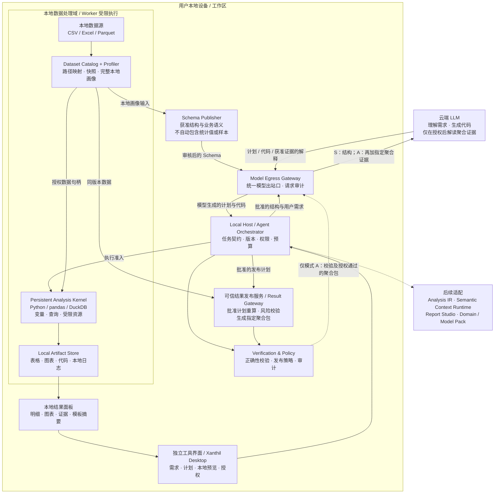

# Xanthil 本地化数据处理工具产品方案（proposal 固化版）

> **来源与优先级说明**：本文件是 dev-flow 的规格事实源，固化自 2026-09-30 用户提供的《Xanthil 本地化数据处理工具产品方案 v1.0》全文（原文件名 `xanthil_local_code_analysis_product_plan_v1.0.md`），另附两张图为**早期草案可视化**（一张架构图、一张「MD 版」产品信息图）。**当正文 v1.0 与图片冲突时，以正文 v1.0 为准**。已知的图片旧版与 v1.0 正文冲突点（正文明确弃用）：
> - 图片保留「数据暴露等级 Level 0–3（含 Level 3 完整上下文 / Level 2 脱敏样本）」；v1.0 §4.4 明确不沿用该模型，改为**模式 S（结构编程，默认）/ 模式 A（授权聚合解读）**两模式，且原始明细或「脱敏样本」发送云端不属默认能力、不纳入本版 MVP。
> - 图片中 Result Gateway 描述为「PII 过滤/脱敏扫描」；v1.0 §6.7 重新定义为**可信发布服务**（基于用户批准计划与同版本数据重算聚合），不盲信任意 Python 输出、禁止用另一个云端 LLM 判敏感。
> - 图片 MVP 含「聚合结果回传」默认能力；v1.0 中聚合外发仅限模式 A 显式授权。
> - 图片将 scipy/sklearn/polars 列入内核首期依赖；v1.0 §6.5 首期仅 pandas + DuckDB + 本地制图。
>
> 目标一句话：在空项目 `local-code-analysis-mode` 中落地实现本方案（工程起点为 M0 边界验证 + M1 CSV 核心闭环，按 §13/§17 分期推进）。

---

# Xanthil 本地化数据处理工具产品方案

> **副标题：基于 Local Code Analysis Mode 的本地优先分析执行工具**
> **版本：v1.0｜日期：2026-09-30｜状态：产品设计方案，待工程实现与验收**
> **范围：工具级产品，可独立验证，可作为 Xanthil Desktop 的本地分析执行模块。本文不是整套 JuanerAI 产品方案，也不要求重构现有开发流程。**

---

## 0. 执行摘要

本工具把"理解分析需求"与"接触业务数据"分开：用户选择本地 CSV、Excel 或 Parquet 文件；本地程序提取并审核表结构；Agent 根据用户问题和获准提供的结构信息生成 Python / SQL；代码在本地分析内核中处理真实数据；结果在本地展示、保存和导出。

**默认模式下，云端模型只接收经审核的表结构和业务口径，不接收原始记录，也不接收数据派生的统计值或计算结果。** 用户需要模型解读真实结果时，可以另行授权发送指定聚合结果；这应明确标记为"授权聚合解读"，不能继续描述为"任何数据都不进入模型"。

产品的核心能力是：

| 能力 | 用户获得的结果 |
|---|---|
| 自然语言生成分析代码 | 不必先手写完整 Python / SQL，就能开展本地处理 |
| 本地分析执行 | 原始数据无需通过模型接口上传，计算由本机执行环境承担 |
| 持续分析状态 | 同一会话可以复用已注册数据、变量、查询与中间产物 |
| 明确的数据边界 | 用户可以看见模型实际收到什么，而不是只相信一句"不上传" |
| 可验证、可复现 | 保存数据版本、代码、口径、执行记录与结果之间的关系 |

**产品原则：模型理解结构，代码接触数据，用户决定结果是否提供给模型。**

> 本文所有 API 名称、状态、配置和验收阈值均为拟议设计，不代表已经存在的 Xanthil 能力。引用的第三方资料仅用于说明工程参考；本方案没有完成源码移植、性能测试或安全认证。

## 1. 产品定位与边界

### 1.1 产品定义

**Xanthil 本地化数据处理工具**是一个以本地执行为核心、由 Agent 辅助编程的数据处理与分析工具。

它将以下流程产品化：

```text
选择本地数据 → 确认表结构与口径 → 自然语言提出需求
→ Agent 生成代码 → Host 审核执行请求 → 本地计算
→ 本地结果与证据 → 可选的授权聚合解读
```

它不是"把 CSV 内容塞进提示词"，也不是不受限制地让 Agent 操作整台电脑。

### 1.2 目标用户与首批场景

| 用户 | 首批任务 | 主要交付物 |
|---|---|---|
| 数据分析人员 | 数据清洗、分组汇总、关联、对账、趋势分析 | 清洗表、汇总表、代码、校验结果 |
| 运营、商品、营销等业务分析与决策人员 | 销售变化、会员结构、活动表现、品类对比 | 指标表、图表、口径说明 |
| 需要可控执行环境的开发者 | 在本地数据上运行可复用分析步骤 | 参数化任务、运行记录、结果工件 |

首期以**结构化表格数据的可验证处理**为主，不以自动形成复杂经营决策或自动执行业务动作作为验收目标。

### 1.3 独立运行与 Xanthil Desktop 集成

采用"一个核心，两种接入形态"：

- **独立工具形态：** 提供最小本地界面或命令入口，完成导入、需求、执行、结果与导出的闭环，方便单独验证。
- **Desktop 集成形态：** 通过适配层接入 Xanthil Desktop，复用现有会话、Agent、模型配置和工作区，不再建设第二套重复能力。

这不是要求先做一套大型独立应用再重新集成。若 Desktop 已有合适入口，直接集成同一核心即可；独立入口主要服务测试、验证和其他调用方。

### 1.4 首期不做

首期不建设企业数据仓库、完整 BI 平台、自动化模型训练平台、多 Agent 递归分析、自动策略执行，也不以 Semantica、Ontology、Domain Pack、Model Pack、OSM 或 Report Studio 的完成作为本工具运行前提。

不提供任意文件、任意网络、任意系统命令的默认执行权限。原始明细或所谓"脱敏样本"发送云端，不属于本工具默认能力，也不纳入本版 MVP。

## 2. 需要解决的产品问题

### 2.1 数据使用与模型推理耦合

用户需要模型帮助理解需求和编写代码，但并不一定愿意让模型接触交易明细、客户信息或内部经营结果。因此，产品需要把**数据读取权限、代码执行权限和模型上下文权限**拆开，而不是一次授权全部开放。

### 2.2 只知道表头，仍可能算错

字段 `amount` 可能表示订单金额、实付金额或退款金额；一行也可能是订单、订单商品行或支付流水。模型即使写出了可执行代码，也可能使用错误分母、重复计数或忽略退款。

产品需要提供最小业务语义，而不是自动上传样本来弥补所有歧义。

### 2.3 多轮分析缺少连续状态

"改成按品类看""只看老客""换一个时间窗口"应复用数据注册、处理步骤与中间结果，而不是反复复制文件或从头计算。与此同时，必须防止旧变量与新数据版本混用。

### 2.4 执行输出可能绕过原始文件上传限制

即使没有上传 CSV，工具输出、报错、图表、截图或日志也可能包含真实记录。Jupyter 协议本身就存在 stdout、stderr、执行结果、富媒体展示与错误消息等多个输出入口。[R4]

因此，本工具不能把原始内核响应直接拼回模型会话。

## 3. 核心产品原则

| 原则 | 具体要求 |
|---|---|
| 默认最小披露 | 默认只发送经用户确认的 Schema 和语义说明；统计值需另行授权 |
| 原始数据本地处理 | 原始文件、DataFrame、临时表、缓存和明细结果默认仅在工作区内使用 |
| 本地可看，不等于模型可看 | 用户界面的明细预览与模型上下文是两条独立通道 |
| 执行权由 Host 管理 | 模型不能自行扩大数据范围、修改安全策略或获取模型密钥 |
| 输出默认不放行 | 未登记、未分类、未授权的执行内容只留本地；无法判断时阻断外发 |
| 安全与正确性分别验证 | 隐私检查通过不等于指标正确，程序退出成功不等于分析成立 |
| 状态可追溯 | 每次运行绑定数据版本、口径版本、代码版本、策略版本与结果 |
| 失败明确可见 | 超时、内核重启、数据变更、外发阻断均须向用户说明，不伪造完成 |

## 4. 两种模型协作模式

### 4.1 模式 S：结构编程模式——默认

**目标：让云端模型帮助设计与编写分析程序，不让其读取真实业务值。**

允许提供：用户经确认的问题、数据集别名、字段名或字段别名、字段类型、行粒度、指标定义、可用库与受控 API 说明。

不提供：原始记录、样本、行数、缺失率、唯一值数、最小值、最大值、分布、聚合结果、图表像素、明细导出文件、未经处理的日志或异常。

本地可以进行全面分析，并向用户展示数值、图表和明细。云端模型只负责分析方法、代码与通用说明，**不能在没有收到计算结果的情况下声称已经解释了真实业务表现。**

严格模式下，结果摘要可以通过本地确定性模板生成，例如把本地计算出的同比、环比、排名填入预先确认的句式。涉及数据驱动的进一步解释，可由用户自己判断，或明确切换到模式 A。

运行时的异常与数据依赖状态默认只在本地展示；静态语法错误、缺失库名称、获准使用的字段名等结构性诊断可用于代码修复。不得为了让模型修复报错，自动附带异常中的原值或整段 traceback。

### 4.2 模式 A：授权聚合解读模式——用户主动启用

**目标：让模型在明确授权后，解读限定范围内的聚合证据。**

前半段执行与模式 S 相同。计算完成后，可信发布服务按照用户确认的发布计划生成候选包，经过政策校验和用户确认，再发送给模型。

允许范围可以包括指定统计元数据、分组指标或证据摘要，但每类内容都须列入授权，不因"已经聚合"而自动认为安全。

界面应明确显示：

> 本次会向所选模型发送指定聚合指标；不发送原始记录。聚合指标仍属于您的业务信息。

模型只依据已发布的证据做解读，不得把未获准查看的本地工件当作自己已经阅读的材料。

### 4.3 模式对照

| 项目 | 模式 S：结构编程 | 模式 A：授权聚合解读 |
|---|---|---|
| 用户确认的 Schema / 业务口径 | 可发送 | 可发送 |
| 统计元数据 | 不发送 | 按字段与用途授权 |
| 原始记录、脱敏样本 | 不发送 | 不发送 |
| 聚合结果、数据派生统计值 | 不发送 | 经发布校验和授权发送 |
| 图表及明细本地显示 | 支持 | 支持 |
| 云端模型解释真实计算结果 | 不支持；采用本地摘要或用户解读 | 仅解释实际获准发送的内容 |
| 多轮分析 | 复用本地状态，但结果不自动反馈给模型 | 可以依据已发布证据继续分析 |
| 默认选择 | 是 | 否 |

### 4.4 本地模型与"数据不进模型"的区别

本地模型是部署位置，不是隐私模式。给本地模型读取明细，仍属于"数据进入模型"，只是推理可能没有离开本机。未来增加本地模型时，也应明确配置其读取范围、日志与网络权限，而不是自动豁免数据边界。

本方案不沿用把"完整上下文"直接列为默认最高等级的做法，避免把**不出本机、不上传原始记录、不进入模型**混为一谈。

### 4.5 承诺的适用范围

"只提供结构"不是"没有任何信息对外披露"：字段名、字段含义和用户问题本身也可能敏感，应支持别名化与发送前确认。

产品目标是建立并测试明确的应用数据通道约束，不声称通过一个过滤器即可证明信息论意义的零泄漏，也不声称控制了操作系统中所有第三方软件、备份工具或外部同步行为。

## 5. 典型用户流程与界面

### 5.1 主流程

1. **创建工作区。** 选择数据目录、输出目录和隐私模式；默认模式 S。
2. **登记本地文件。** 系统记录数据集别名、文件版本和读取范围，不调用模型上传接口。
3. **确认表结构。** 本地解析字段与类型；用户确认订单粒度、金额含义、时间字段及必要的关联关系。
4. **输入分析需求。** Agent 只获得当前政策允许的上下文。
5. **确认分析计划。** 展示数据范围、计算口径、生成代码和预期输出；高风险操作先审批。
6. **本地运行。** Host 检查请求后交给分析内核；界面显示状态、可取消操作和资源情况。
7. **查看本地结果。** 指标、图表、校验记录与明细输出都通过本地结果面板查看。
8. **可选授权解读。** 模式 A 展示候选发送包，用户确认后模型才能看到这些聚合证据。
9. **追问与复用。** 复用符合版本与权限条件的数据和中间结果；口径变化形成新版本。
10. **保存或导出。** 保存处理结果、代码和可复现记录；导出范围由用户明确选择。

### 5.2 工作台布局

| 区域 | 内容 | 关键交互 |
|---|---|---|
| 左侧数据区 | 本地数据集、Schema、粒度、版本 | 添加文件、字段别名、查看本地样本 |
| 中间任务区 | 用户问题、分析计划、代码与运行进度 | 确认计划、编辑代码、运行、取消 |
| 右侧结果区 | 指标、图表、表格、证据与校验结果 | 筛选、查看明细、本地导出 |
| 上方边界状态 | 当前模式、模型接收范围、最近外发记录 | 切换模式、撤销后续授权 |
| 展开的执行面板 | 内核状态、缓存、代码、脱敏诊断 | 重启内核、重跑、查看原始本地日志 |

**"数据预览"不属于模型对话消息。** 打开表格、复制图表、查看日志，均不得自动触发模型读取。

### 5.3 "模型将收到什么"预览

授权页面至少展示模型供应商与模型标识、任务目的、数据集别名、字段列表、结果范围、敏感字段处理方式、发送次数范围和授权到期条件。

一次授权绑定精确的结果包摘要、模型目标和策略版本。结果变化或更换模型目标时，旧授权不得继续生效。撤销授权只阻止未来发送，不能宣称收回已经发送给模型供应方的内容。

## 6. 核心功能模块

### 6.1 Dataset Catalog：本地数据集目录

维护 `dataset_id`、工作区、逻辑别名、源格式、本地路径映射、版本、Schema 版本、读取权限与敏感等级。

模型使用 `dataset://sales` 等逻辑标识，不接收用户桌面的绝对路径。路径解析、符号链接处理和文件授权由 Host 负责。源文件默认只读，清洗结果另存为新工件，不覆盖原件。

对源文件变化建立检测机制。可复现任务绑定不可变快照或经过验证的内容版本；仅依赖文件名不能作为版本判定。

### 6.2 Metadata Profiler：本地结构与语义准备

分开生成两类对象：

| 对象 | 内容 | 默认去向 |
|---|---|---|
| `LocalProfile` | 行数、空值、分布、采样检查、异常值、原始路径等完整本地画像 | 本地存储与界面 |
| `ModelSchemaCard` | 经审核的别名、字段类型、含义、行粒度和关联约束 | 通过出站网关发送模型 |

CSV 类型推断属于本地解析结果，应允许用户修正；标识字段不能因为看起来像数字就丢失前导零。抽样推断与全量检查必须区分，尚未全量扫描时不能把估算行数显示为精确值。

最小语义卡包括：一行代表什么、主键或候选键、金额口径、时间与时区、退款处理、去重规则、关联基数。字段枚举值和真实样本不自动附带。

### 6.3 Analysis Planner / Code Generator：规划与代码生成

将用户需求转换为轻量 `AnalysisTaskSpec`，至少包含输入数据、版本、目标、计算口径、步骤、代码、预期结果、校验项、资源预算与发布政策。

首期不自建完整分析语言。已有 Analysis Contract / Analysis IR 时优先适配；独立运行时使用最小任务契约即可。

模型只能提出执行或发布请求，不能自行批准。数据口径不完整时明确标注假设，涉及核心指标时让用户确认，而不是从字段名称中猜测业务定义。

### 6.4 Local Host：权限与执行控制

Host 是策略、任务状态、审批和资源控制的权威管理者，负责：

- 模型请求组装、工具授权和预算管理。
- 工作区、数据版本、任务版本与会话的绑定。
- 校验 Python / SQL 执行请求、发放最小能力、取消和终止任务。
- 管理凭据、外发授权、结果发布、审计和工件登记。

Python Worker 不能直接读取模型密钥，不能写 Host 的授权数据库，也不能修改自己的权限。Host Bridge 应是窄接口，而不是允许 Python 通过桥接调用任意模型请求、任意文件操作或任意网络代理。

### 6.5 Analysis Kernel：持久本地分析内核

首期拟采用 Python 内核，配合 pandas、DuckDB 和本地制图能力。polars、scipy、statsmodels、sklearn 等作为后续按场景引入的能力，不全部成为初版依赖。

内核支持数据集句柄、DataFrame、变量、中间表、查询结果和本地工件的跨轮复用；同一会话的可变状态执行默认串行，避免多个任务同时修改同一变量。

必须提供启动、执行、中断、强制终止、重启、健康检查、资源统计和版本失效机制。

**持久内核不等于把所有文件全部常驻内存。** 大表优先使用关系查询、按需读取或磁盘中间产物；只对合适的工作集转成 DataFrame。DuckDB 支持部分超内存执行，但并非所有查询和内存分配都可以无限溢写，因此不能用它承诺任意规模任务都可在普通电脑上完成。[R6]

### 6.6 Local Artifact Store：本地工件与结果展示

保存清洗表、汇总表、图表、代码、执行记录和必要中间产物。每个工件具有随机 ID、产生它的执行 ID、数据版本、类型、敏感等级与本地路径。

工件引用默认只是本地句柄，不是云端可下载链接。为报告或外部系统导出文件，应是独立的显式操作，不等同于给模型授权。

用户可查看完整本地结果，但 HTML、SVG 等展示内容必须经过安全渲染，不执行工件中的脚本，也不加载远程图片、字体或资源。

### 6.7 Result Gateway：结果分类与可信发布

网关不只是正则脱敏器，也不默认信任生成代码宣称的 `safe=true` 或 `aggregate=true`。

它首先把所有执行输出视为**本地结果**；只有模式 A 下的明确发布请求，才进入外发审核。

| 结果类型 | 默认处理 |
|---|---|
| 原始记录、用户级或订单级表格 | 仅本地展示 |
| stdout、stderr、完整异常、任意字符串 | 仅本地保存，不直接进入模型上下文 |
| 图表、HTML、SVG、图片和模型文件 | 仅本地展示或导出，不自动上传 |
| 任意 Python 产生的所谓聚合表 | 视为候选结果，不自动放行 |
| 可信发布服务按批准计划生成的聚合包 | 校验后进入授权与外发流程 |

**可信发布机制：** Host 持有用户批准的指标、维度、筛选范围和政策；独立可信发布服务基于同一不可变数据版本重新执行允许的聚合操作，生成结果包。它不盲信任意 Python DataFrame 的数值、样本量或血缘声明。

不能被可信服务验证或重算的复杂 Python 结果，MVP 默认只留本地，不用一次点击代替可信性校验。

发布校验包括维度白名单、敏感类别、最小独立主体数、结果规模、数值精度、禁止原始文本、任务范围和重复查询风险。主体应根据场景定义，例如独立客户，而不是用大量重复订单行冒充足够多的人。

最小分组阈值只是风险降低手段，不是匿名性证明；还要考虑差分查询、小群体、敏感类别标签及多次发布之间的组合推断。本版不承诺差分隐私保证。

### 6.8 Model Egress Gateway：模型出站网关

所有模型请求只能经过统一出站网关。它负责按模式构建上下文、验证发布授权、检查允许目标、限制请求体并形成可核对的发送记录。

治理范围不只是工具返回值，还包括用户粘贴内容、字段说明、会话历史、自动压缩摘要、子任务消息、截图、调试遥测、附件和错误报告。

模式 S 下仅接收批准的结构上下文；不自动接收数据依赖的运行输出。模式 A 下只额外接受 Host 授权的发布包。Python Worker 不持有通往该网关的通用转发能力。

不允许用"先发给另一个云端 LLM 判断是否敏感"的方式实现本地隐私过滤。

### 6.9 Verification & Audit：校验与审计

为每次运行分别记录执行成功、数据质量检查、指标校验、隐私校验和发布状态。

审计至少包含任务 ID、数据版本、代码摘要、策略版本、模型目标、授权人、放行或阻断原因、工件 ID 和发送内容摘要。敏感本地日志与模型会话存储分开，不能在恢复会话或压缩上下文时重新混入。

## 7. 产品工具架构图

以下 Mermaid 图表达本方案的逻辑边界。可直接在支持 Mermaid 的 Markdown 编辑器中渲染；虚线代表条件发布或后续集成。它不是要求全部模块首期都拆成独立服务。



**架构必须满足的关系：** 原始数据不连到云端模型；Worker 不直连云端模型；模型出站路径只有一个；本地预览不经过模型；聚合发布是显式分支，不是所有执行结果的默认回传路径。

## 8. 执行安全与数据出站治理

### 8.1 威胁模型

本工具把模型生成代码、输入文件内容、字段说明和第三方扩展视为可能出错或不可信的输入。重点防范误上传、任意文件读取、主动联网、权限提升、数据嵌入输出、资源耗尽和会话串数据。

本版不以已经被攻陷的操作系统、管理员级恶意进程、硬件侧信道或用户主动使用外部软件复制数据为可完全控制的范围。

### 8.2 执行隔离要求

| 控制面 | 最低要求 | 不能作为替代品的做法 |
|---|---|---|
| 文件 | 仅挂载或授权当前任务输入；原件只读；写入任务输出目录 | 只在提示词中要求"不读其他文件" |
| 网络 | Worker 默认拒绝外部网络与不必要的本机服务访问 | 只屏蔽 `requests` 或某几个函数 |
| 凭据 | 模型密钥由出站组件持有，不进入 Worker 环境变量或工作区 | 让 Agent 自觉不打印密钥 |
| 进程 | 受限身份和 OS 级隔离；限制子进程及系统调用能力 | 仅因为是 Python 子进程就称为沙箱 |
| 资源 | 执行超时、内存与进程限制、临时空间配额、可终止整棵任务进程树 | 仅靠单个数据库内存设置 |
| 依赖 | 隔离前预装经过审核的依赖；运行中不自动联网安装 | 模型发现缺包就直接 `pip install` |
| 策略 | Host 维护、版本化，Worker 不可改写 | 把权限配置与代码放进同一可写目录 |
| 工件展示 | 本地渲染、禁脚本、禁远程资源、路径受控 | 把任意 HTML 直接放进有权限的 WebView |

**静态代码检查、AST 检查、导入白名单和敏感信息检测都是辅助措施，不构成任意 Python 的完整安全边界。** 首期允许哪些平台运行真实敏感数据，必须以该平台的实际隔离验证为依据。

若目标平台尚未实现可靠隔离，应阻止敏感数据上的自由 Python 执行；可暂时只开放 Host 验证后编译的受限操作计划，或使用合成数据做开发验证。不能以"无需容器"为理由，默认给生成代码完整用户权限。

运行时隔离可以采用适合目标系统的原生机制或可替换的隔离后端；本方案不强制改变现有本机开发方式，也不要求开发过程整体迁入容器。

### 8.3 SQL 同样需要隔离

DuckDB 官方说明，SQL 及部分非 SQL 接口可能涉及文件、网络和扩展，并强调相关配置不能替代适当的沙箱。[R5]

据此，本工具应把生成 SQL 视为代码：只访问登记的数据对象，拒绝未授权路径和远程源，禁用非必要扩展与运行时安装，对查询及导出做准入控制。参数化只能解决部分输入问题，不等于把任意 SQL 变成安全操作。

### 8.4 不能遗漏的输出渠道

统一审查范围包括 `print(df)`、`df.head()`、表达式自动展示、报错中的单元格值、日志、DataFrame 转 JSON、HTML、SVG、图片、图例、标签、文件名、工件描述、Notebook 输出、模型文件和调试遥测。[R4]

甚至一个浮点数也可能被不可信程序用来编码敏感值。因此，"没有手机号正则命中""只有几个数字""结果行数很少"都不足以自动放行。模式 A 的机器放行必须依赖可信发布路径，而不只是扫描任意程序的输出。

### 8.5 默认拒绝与授权完整性

没有策略、无法识别输出类型、数据版本改变、结果包改变、授权过期或目标模型改变时，出站网关默认拒绝，不回退为上传完整数据。

任意工具、扩展和子 Agent 都不得绕过出站网关。后续接入其他 JuanerAI 模块时，也必须继承同一边界，而不是在报告生成、记忆写入或远程日志中重新泄露结果。

## 9. 技术实现建议与 Prime Agent 借鉴边界

### 9.1 借鉴什么

Prime Agent 的官方文档描述了持久 Python 控制环境、由 TypeScript Host 管理模型调用与会话权威状态，以及客户端、Worker、Kernel 与持久化的职责分离。[R1][R2][R3]

本工具吸收的是这些工程模式：

| 参考机制 | 本工具落地方式 |
|---|---|
| 持久 Python 环境 | 实现可复用数据句柄与变量的 Analysis Kernel |
| Host / Kernel 分工 | 模型与 Python 提出动作，Host 管理授权和生命周期 |
| 界面与执行分离 | UI 关闭或断线不直接等于运行状态消失 |
| 会话及工件管理 | 绑定分析任务、数据版本、代码和本地结果 |

Prime Agent 官方也明确指出，Worker 和 Kernel 并不是安全沙箱，生成代码通常以用户权限运行。[R1] 因此，不能直接安装或复制其 Python 能力，就宣称已经实现本工具的隐私要求。

### 9.2 不整体搬入什么

不以 Prime Agent 替换现有 Agent 底座，不强制迁移到它的完整 daemon 架构；不首期搬入自动自改 Harness、递归子 Agent、无人值守执行、任意 Shell 或默认把执行输出回传模型的交互方式。

移植任何具体代码前，应单独核对目标提交、依赖、许可证及安全边界。本文核查的是公开文档，不是完成了源码与运行行为审计。

### 9.3 推荐的最小技术组合

| 层 | 首期建议 | 选型边界 |
|---|---|---|
| 界面 | 复用现有 Desktop UI；独立形态保留最小入口 | 不为本工具重复开发一套复杂桌面壳 |
| 本地 Host | 复用现有 Runtime，通过适配层接入 | 首期只增加必要的任务、授权和执行接口 |
| Python 执行 | Kernel Manager + Python Worker；可评估 `ipykernel` / `jupyter_client` | 将协议适配封装，不能把内核消息直接转发模型 |
| 表格与查询 | pandas + DuckDB | 优先把适合关系运算的任务留在查询层，避免无必要的大表转内存 |
| 元信息 | SQLite 等本地事务型存储 | Host 单写入方；任务与策略变更保留版本 |
| 工件 | 本地文件系统 + Parquet / JSON / 图片等格式 | 与模型消息存储分离，分配最小文件权限 |
| 安全 | 目标系统可验证的隔离后端 + 出站网关 | 未通过隔离验收的平台不开放敏感自由执行 |
| 验证 | 自动化正确性测试 + 对抗性出站测试 | 与 UI 联调并行推进，不等上线后再补 |

标准 Jupyter 消息可以支持执行、中断相关控制、状态和多类输出，但应用仍要负责消息关联、权限、资源限制与展示边界。[R4] 不必照搬 Prime Agent 的内部通信协议。

## 10. 最小接口与数据契约

本节是供工程拆解使用的**接口草案**，不是已经可调用的 SDK。

### 10.1 核心对象

| 对象 | 作用 | 关键字段 |
|---|---|---|
| `DatasetRef` | 定位获准使用的数据版本 | `workspace_id, dataset_id, version, schema_version` |
| `ModelSchemaCard` | 模型能看到的结构信息 | 字段别名、类型、语义、粒度、关联约束 |
| `AnalysisTaskSpec` | 记录分析目标与口径 | 数据引用、指标定义、步骤、校验项、输出要求 |
| `ExecutionRequest` | Host 到执行侧的准入请求 | 任务版本、代码摘要、能力集、预算、策略版本 |
| `LocalResult` | 本地计算结果索引 | 运行状态、本地工件引用、校验状态、敏感等级 |
| `PublicationPlan` | 用户批准的发布范围 | 指标、维度、筛选、主体定义、最小群体、目标模型 |
| `ModelSafeEnvelope` | 获准外发的精确载荷 | 可信生成内容、来源版本、授权引用、载荷摘要 |
| `ExecutionRecord` | 复现与审计记录 | 输入、代码、环境、结果、错误分类和发布事件 |

### 10.2 Host / Worker 接口

```text
register_dataset(local_file, import_options) -> DatasetRef
build_schema_card(dataset_ref, approved_semantics) -> ModelSchemaCard
create_analysis_task(user_goal, dataset_refs, policy_ref) -> AnalysisTaskSpec
start_kernel(workspace_id, isolation_profile) -> KernelRef
execute(task_ref, execution_request) -> LocalResult
cancel(execution_id) -> LocalCancellationStatus
restart_kernel(kernel_ref) -> NewKernelRef
list_artifacts(execution_id) -> LocalArtifactRefs
prepare_publication(publication_plan) -> LocalPublicationPreview
approve_publication(preview_digest, destination) -> ApprovalRef
send_to_model(approved_context_ref) -> ModelResponse
```

模型与 Worker 不直接调用最后两个授权或出站接口；它们只能提出待审批请求。授权动作来自用户或受管理的既有政策，且禁止模型自行修改政策。

### 10.3 执行请求示例

以下示例仅用于说明结构，数值为拟议配置而非性能承诺：

```json
{
  "task_id": "task_001",
  "task_revision": 1,
  "workspace_id": "workspace_001",
  "kernel_id": "kernel_001",
  "datasets": [
    {
      "dataset_id": "sales",
      "version": "snapshot_001",
      "schema_version": "schema_001"
    }
  ],
  "execution": {
    "language": "python",
    "code_ref": "code_001",
    "network": "deny",
    "source_access": "read_only",
    "write_scope": "task_artifacts_only",
    "timeout_seconds": 120
  },
  "privacy": {
    "mode": "schema_only",
    "policy_version": "policy_001",
    "allow_raw_rows_to_model": false,
    "allow_derived_values_to_model": false,
    "allow_unfiltered_output_to_model": false
  },
  "validation": {
    "required_checks": [
      "input_version_matches",
      "metric_definition_confirmed",
      "aggregation_reconciles"
    ]
  }
}
```

这些字段是请求声明，不是安全实现本身。网络、文件权限和预算必须由执行环境强制实施；Worker 不能通过修改请求副本使限制失效。

### 10.4 发布包的关键约束

`ModelSafeEnvelope` 必须由可信发布链生成，不能由生成代码自签。授权绑定载荷摘要、数据版本、任务目的和目标模型。重新生成内容后，即使看起来相似，也须重新验证授权是否仍有效。

只允许结构化且有类型约束的发布内容。任意自由文本、文件路径、图片、模型序列化内容和来源不明的数值不得伪装成"摘要"绕过校验。

## 11. 会话状态、复现与错误处理

### 11.1 三类状态分开管理

| 状态 | 内容 | 生命周期 |
|---|---|---|
| 模型对话状态 | 经批准的 Schema、计划、代码、获准证据 | 可压缩，但不能从本地日志补入敏感内容 |
| 内核运行状态 | 变量、DataFrame、连接、临时查询对象 | 内核存活期间有效；重启后可能丢失 |
| 持久分析资产 | 输入版本、任务契约、代码、环境清单、工件 | 保存在本地，可被审计和重新执行 |

**会话还在，不代表所有 Python 对象都可恢复。** 首期提供同一内核跨轮复用，并保存复现配方；内核重启后通过数据版本和代码重跑恢复必要结果，不承诺任意对象的无损自动快照。

不把未经信任的 Python 对象反序列化作为跨任务恢复手段。优先保留经过约束的结构化状态和明确数据格式。

### 11.2 缓存与失效

缓存键至少包括输入版本、代码摘要、参数、环境版本和影响结果的业务口径。数据、字段类型、口径或关键依赖变化时，相关结果标记为失效。

权限收紧后，立即停止后续使用与发布；必要时终止内核并清理其已载入数据。不能只撤销文件读取权限，却继续允许旧 DataFrame 被访问。

### 11.3 任务与发布状态分离

```text
任务：draft → awaiting_confirmation → ready → running
      → succeeded / failed / cancelled

结果校验：not_checked → passed / failed / needs_review

模型发布：local_only → prepared → awaiting_approval
          → sent / blocked / expired
```

"运行成功但结果禁止外发"是合法状态，不应显示为整个分析失败；"运行成功但指标校验失败"也不能显示为已经完成可靠分析。

### 11.4 常见故障处理

| 故障 | 产品行为 |
|---|---|
| 字段不存在或类型不匹配 | 本地显示原因；仅发送获准的结构性诊断进行修复 |
| 混合编码、非法日期、坏行 | 显示导入报告；由用户选择规则，不静默丢行 |
| 关联后金额膨胀 | 标记校验失败，提示关联基数与重复粒度问题 |
| 内存或临时盘不足 | 终止或降级为受支持的分块 / 查询方案，不循环重试耗尽资源 |
| 内核崩溃 | 标记内核状态丢失，展示可重跑步骤与持久工件 |
| 模型服务不可用 | 已确认的代码仍可本地执行；不伪造新的模型回复 |
| 聚合包不符合政策 | 保留本地分析结果，解释阻断原因，不自动放宽权限 |

自动修复需要有限的重试、时间与费用预算。首期可以采用可配置的少量重试上限，达到上限转为人工确认，而不是无限循环。

## 12. 完整业务示例：销售下降分析

> 本节仅用于演示产品交互；字段、口径和数值均为虚构，不代表用户真实业务。

### 12.1 输入与口径

用户选择本地 `sales.csv`，含订单号、订单日期、客户号、品类与净销售额。确认一行是订单商品行，净销售额已按统一规则扣除退款；订单数按订单号去重，品类销售额按商品行净额求和。

用户提出：

> 比较 7 月与 8 月的净销售额变化，判断下降主要集中在哪些品类，并检查订单数和客单价的变化。

本地 Schema 卡向模型提供这些结构与口径，不提供任何订单内容。模型生成计划：校验日期范围，计算两个月的净销售额、去重订单数和客单价，再计算品类贡献并做对账。

### 12.2 本地执行结果

| 指标 | 7 月 | 8 月 | 变化 |
|---|---:|---:|---:|
| 净销售额 | 12,000,000 元 | 10,800,000 元 | -10% |
| 去重订单数 | 100,000 | 90,000 | -10% |
| 客单价 | 120 元 | 120 元 | 0% |
| 女装净销售额 | 7,200,000 元 | 6,000,000 元 | -1,200,000 元 |
| 男装净销售额 | 4,800,000 元 | 4,800,000 元 | 0 元 |

可信校验器检查品类金额合计是否等于总净销售额、月份边界是否一致、订单粒度是否正确、除法分母是否为零，以及金额精度规则是否满足要求。

### 12.3 模式 S 下的交付

上表和趋势图只在本地显示。本地模板可以生成：

> 8 月净销售额较 7 月下降 10%；订单数下降 10%，客单价持平。品类维度的销售额下降集中在女装。

云端模型不会收到表中的数值，不应声称自己"已经发现了女装下降"。它可以继续给出通用分析思路，或者按用户指定的新维度生成下一段代码。

### 12.4 模式 A 下的交付

用户批准发布上述月度与品类聚合指标，并确认品类名称和经营规模允许提供给模型。可信发布服务重算同版本指标，检查主体数、维度、数值和授权目标后发送。

模型据此给出受证据约束的解释：下降在算术分解上对应订单数减少，品类贡献集中于女装；但这并不证明"活动失效""商品吸引力下降"或任何因果机制。要继续诊断，需要进一步的流量、转化、供给等证据。

这一区分使工具能够输出可用结果，同时避免把描述性分解包装成已验证的经营原因。

## 13. MVP 范围与分期

### 13.1 首个可验证闭环

最小工程里程碑先以 CSV 跑通：

```text
本地 CSV → 结构确认 → Agent 生成代码 → 隔离执行
→ 本地结果与校验 → 保存代码与工件 → 第二轮复用
```

这个里程碑不是最终 MVP 范围。正式 MVP 应补齐承诺的文件支持、聚合授权和关键安全验收。

### 13.2 正式 MVP 功能范围

| 功能项 | MVP 要求 |
|---|---|
| 文件支持 | CSV、规范表格型 `.xlsx`、Parquet；明确不支持宏执行及复杂合并报表自动理解 |
| 数据准备 | 本地导入、类型修正、语义确认、只读源文件、数据版本 |
| 模型协作 | 模式 S 默认可用；模式 A 需单独授权 |
| 分析编程 | 受支持的 Python / SQL；清洗、筛选、聚合、关联、趋势、对账 |
| 执行环境 | 一条可验证的受限执行路径；取消、超时、重启、资源限制 |
| 持久状态 | 同会话变量与数据句柄复用，数据变化时失效 |
| 结果展示 | 本地表格、图表、明细预览、确定性摘要 |
| 结果发布 | 首批已定义指标与聚合模板的可信发布；不支持任意输出自动放行 |
| 导出 | 本地数据文件、图表、分析代码、任务与执行记录 |
| 审计 | 模型实际接收内容可核对，原始日志与模型消息分离 |
| 可复现 | 绑定数据版本与代码，支持明确步骤的重跑 |

### 13.3 后续能力

后续按真实任务需求引入 polars 或统计方法、参数化分析 Skill、更多数据源、更完善的检查点、复杂模型结果验证和企业权限适配。

多 Agent、长时间自治、领域包自动绑定、模型训练及决策回写都不是首期必需。优先完成"一次真实业务分析正确、可控、可复用"，再扩展能力宽度。

## 14. 验收标准

### 14.1 功能与正确性

| 编号 | 测试场景 | 通过条件 |
|---|---|---|
| F01 | CSV / XLSX / Parquet 导入 | 在支持格式约束内正确读取；错误与不支持情况有明确提示 |
| F02 | ID、日期、金额等字段 | 前导零、时间边界和金额精度符合已确认规则 |
| F03 | 聚合、去重、关联与退款 | 与人工基准或确定性基准一致，不重复计数 |
| F04 | 金额对账 | 分组结果与总额在声明的精度内一致 |
| F05 | 多轮分析 | 第二轮复用已登记数据与必要中间状态，不混入其他会话数据 |
| F06 | 数据版本变化 | 旧结果标记失效，不能静默用于新数据解释 |
| F07 | 取消 / 超时 / 崩溃 | 状态真实，资源可释放；恢复范围明确 |
| F08 | 复现 | 相同数据、参数、代码和环境下得到符合方法容差的结果 |

### 14.2 数据边界与对抗测试

使用合成的敏感标记值和可控测试数据，记录模型接口请求、应用遥测与其他外部网络出口，形成可复核测试证据。

| 编号 | 测试场景 | 通过条件 |
|---|---|---|
| P01 | 模式 S 完成一次分析 | 除获准结构及用户语义外，不外发原始记录或数据派生值 |
| P02 | `print`、`head`、异常原值 | 内容仅在本地；不进入模型会话或云端日志 |
| P03 | HTML / SVG / 图片 / 文件名夹带内容 | 不自动发送；渲染不加载远程资源 |
| P04 | Worker 尝试 HTTP、DNS、外部命令联网 | 在所支持隔离后端中被阻断并留下本地记录 |
| P05 | 越权读取文件、密钥、Host 状态 | 访问失败；Worker 不能提升权限 |
| P06 | 把明细伪装为聚合或编码成数字 | 不通过任意输出扫描放行；可信发布路径拒绝非法计划 |
| P07 | 单人分组、重复行冒充主体数、差分查询 | 按主体定义和发布策略阻断、合并或转人工处理 |
| P08 | 授权载荷、数据版本或模型目标被替换 | 原授权失效，出站请求被阻断 |
| P09 | 会话恢复、压缩和导出 | 不把本地敏感日志重新写入模型上下文 |
| P10 | 撤销授权 / 权限收紧 | 后续发送停止；必要缓存与内核访问撤销 |
| P11 | 网关故障或未知结果格式 | 默认拒绝，不回退到原始输出上传 |
| P12 | 多工作区交叉访问 | 数据、内核、工件和授权不能串用 |

**"泄漏为 0"只能作为限定测试集与受控运行条件下的验收结果，不能据此声称所有攻击和部署环境下绝对零泄漏。** 任一关键数据边界测试失败，应阻止敏感数据场景发布。

### 14.3 体验与性能

采用公开可复现的合成数据集，至少覆盖小型交互任务、百万行聚合任务和大于可用内存的压力场景。记录设备、CPU、内存、磁盘、操作系统、依赖版本、数据宽度、字段类型和测试 SQL / Python。

统计首次可运行时间、运行耗时、峰值内存、临时盘使用、取消响应、第二轮复用耗时和成功率。以相同设备上的人工 Python / SQL 工作流建立基线，再确定发布目标；本方案不预设"千万行秒出"或未经验证的提速倍数。

## 15. 产品成功指标

产品评估分成三个层次，避免只看对话次数或代码生成量。

| 层次 | 指标 | 解释 |
|---|---|---|
| 底线 | 关键隐私与隔离回归通过率 | 是敏感数据可用前提，不是宣传口号 |
| 结果 | 用户确认且通过校验的任务完成率 | 排除只是运行成功但口径错误的任务 |
| 效率 | 从导入到首个正确结果的耗时 | 与同类人工流程比较 |
| 连续性 | 第二轮有效复用率、失效识别准确率 | 同时衡量复用与防止陈旧结果 |
| 信任 | 发送内容可解释率、授权误操作、阻断误报率 | 用户能够理解并掌控边界 |
| 可复用性 | 可重跑任务比例、参数化复用比例 | 衡量是否沉淀为持续工作能力 |

对原始数据外发采用事件级审计与抽样核查，不只依靠界面中的一个开关。对结果正确性同时记录人工确认和自动校验，避免用用户"点了完成"替代计算正确。

## 16. 在 Xanthil / JuanerAI 中的位置

本工具承担的是**本地数据处理与执行能力**，不是上层经营目标管理、分析体系设计或决策系统本身。

| 关联模块 | 本工具提供什么 | 集成边界 |
|---|---|---|
| Xanthil Desktop | 数据登记、代码执行、本地结果、隐私授权面板 | 优先复用现有会话与模型配置 |
| Analysis Core / Analysis IR | 将计划步骤转成受控运行；返回本地证据引用和验证状态 | 不另建冲突的完整分析语言 |
| Semantic Context Runtime | 消费经批准的指标口径、字段映射和语义版本 | 语义也经过上下文最小披露，不自动带业务值 |
| Analysis Blueprint Studio | 按已定义问题树与指标契约执行具体计算 | 不在本工具中重复建设体系编辑器 |
| Report Studio | 提供本地图表、表格、证据和模板摘要 | 使用云端编审或生成时，仍须重新执行出站政策 |
| Domain Pack | 后续导入方法、指标和验证规则 | 未安装包时，通用本地处理仍可工作 |
| Model Pack | 后续提供受控本地推理环境与模型输入输出 | 训练、注册、模型治理不属于本工具首期 |
| 假设库 / 策略库 | 后续提交获准的验证记录和经验候选 | 不默认把原始明细或完整日志写入共享知识 |

接入其他模块不能默认扩大权限。比如"本地报告已经生成"并不代表其完整内容可以被另一个云端 Agent 阅读。

## 17. 实施拆解与交付物

### 17.1 里程碑

| 阶段 | 重点 | 退出条件 |
|---|---|---|
| M0：边界验证 | 合成数据、Schema-only、生成代码、本地执行、出站捕获 | 证明基本链路可行；无未经批准的模型输出回传 |
| M1：CSV 核心闭环 | Dataset Catalog、持久内核、任务契约、本地结果与基础校验 | 一次真实类型业务任务可重复完成，隔离能力通过验证 |
| M2：正式 MVP | XLSX / Parquet、可信聚合发布、授权界面、审计与异常处理 | 第 13、14 节的 MVP 和关键验收项通过 |
| M3：Desktop 产品化 | 适配现有界面、会话、上下文和报告交付 | 工具核心复用，不引入旁路数据出站 |
| M4：能力扩展 | 方法、Skill、更多引擎、模型与企业权限 | 每项扩展具备独立契约与回归测试 |

已有 Desktop 集成能力时，M3 的相关工作可与 M1 / M2 并行，不机械要求先构建第二套应用。

### 17.2 工程交付物

正式交付应包括本地工具入口及 Desktop 适配器、可安装或可管理的执行环境、任务与结果协议、隐私模式说明、可信发布模板、正确性基准、数据边界对抗测试、依赖清单、运行与恢复说明，以及可核对的演示案例。

任务拆解建议以"数据接入""受限执行""模型出站""结果与授权""验证与审计""Desktop 适配"为工作包，并明确对应验收编号。本文只提供拆解依据，不直接修改现有仓库或多 Agent 开发流程。

### 17.3 发布阻断条件

出现以下任一情况，不应将版本用于承诺本方案边界的敏感数据场景：Worker 可以任意联网或读取授权外文件；原始输出自动进入模型；无法区分模式 S 与模式 A；模型可以自批授权；缺少数据版本绑定；核心指标测试存在错误；关键泄漏回归失败；目标平台的隔离能力未验证。

## 18. 主要风险与处理策略

| 风险 | 处理策略 |
|---|---|
| Schema 太少导致方法选错 | 增加用户确认的粒度、口径与字段语义，不默认上传样本 |
| 隐私限制降低自动解读能力 | 明确模式差异；提供本地结果和模板摘要，授权解读为可选能力 |
| 任意 Python 复杂输出无法证明安全 | 保持本地输出；首期只自动发布可信服务支持的有限聚合 |
| 多轮状态污染 | 会话隔离、串行可变执行、数据和代码版本绑定、缓存失效 |
| 首期引擎和依赖过多 | 以 Python + pandas + DuckDB 为主，按真实需求引入扩展 |
| 为了安全直接重构整个项目 | 优先增加窄接口、出站入口和执行适配层，不整体替换 Agent 底座 |
| 本地存储被云同步或备份 | 产品工作区默认不选择已知同步目录并给出提醒；明确系统外部行为边界 |
| 安全描述过度承诺 | 对外说明允许发送什么、禁止什么、支持哪些隔离环境和已完成哪些测试 |

## 19. 官方参考资料与核查说明

核查日期：**2026-09-30**。以下为公开文档参考；仓库 `main` 与在线文档会变化，工程实施应锁定具体提交、依赖版本和测试环境。

| 编号 | 资料 | 本方案使用范围 |
|---|---|---|
| R1 | Prime Agent README | 持久 Python 的总体定位；其 Worker / Kernel 并非安全沙箱的明确警告 |
| R2 | Prime Agent — RLM Programming Model | Python 控制环境、跨调用状态及 Host 管理职责 |
| R3 | Prime Agent — Architecture Overview | UI、Host / Worker、Kernel 与持久化的职责分离 |
| R4 | Jupyter Client — Messaging in Jupyter | 执行、控制、状态、stdout / stderr、异常与富媒体消息类型 |
| R5 | DuckDB — Securing DuckDB | SQL、文件、网络、扩展能力及隔离要求 |
| R6 | DuckDB — Tuning Workloads | 内存、临时空间、超内存处理与工作负载限制 |

- R1: https://github.com/PrimeIntellect-ai/prime-agent
- R2: https://github.com/PrimeIntellect-ai/prime-agent/blob/main/packages/coding-agent/docs/rlm.md
- R3: https://github.com/PrimeIntellect-ai/prime-agent/blob/main/packages/coding-agent/docs/architecture.md
- R4: https://jupyter-client.readthedocs.io/en/latest/messaging.html
- R5: https://duckdb.org/docs/current/operations_manual/securing_duckdb/overview
- R6: https://duckdb.org/docs/current/guides/performance/how_to_tune_workloads

这些资料支撑所列工程事实，不代表第三方项目已经实现 Xanthil 的发布治理、隐私模式、产品界面或验收标准；这些部分是本方案提出的产品设计。

## 20. 最终产品定义

**这是一个让 Agent 根据经授权的表结构生成代码、让 Python / SQL 在本地处理真实数据、让用户在本地查看结果，并自主决定是否向模型提供指定聚合证据的工具。**

首期优先做对三个环节：**结构与口径确认、受限本地执行、受控模型出站。** 在此基础上，再逐步建设持久复用、方法资产和 JuanerAI 模块联动。
